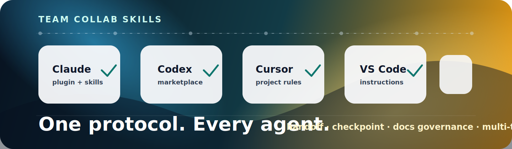

<div align="center">



<br>

[](./LICENSE) [](./LICENSE-DOCS.md)
[](https://docs.anthropic.com/en/docs/claude-code/plugins)
[](https://github.com/openai/codex)
[](#adapter-matrix)
[](https://github.com/dadwadw233/team-collab-skills)

**Keep your AI coding agents on the same page — a shared, file-based way to track project state, hand off work, and let several agents collaborate. Installable for Claude Code, Codex, Cursor, VS Code, Cline, OpenCode, Continue, Gemini CLI, and manual workflows.**

[Quick Start](#quick-start) · [Adapter Matrix](#adapter-matrix) · [Multi-Agent Collaboration](#multi-agent-collaboration) · [中文简介](#中文简介)

</div>

---

## Why This Exists

When a team leans on AI coding agents, work slips through the cracks between sessions: nobody is sure what state the project is in, who owns which TODO, why a past decision was made, or what the last session actually did. Handoffs turn into scrolling back through old chat logs.

team-collab-skills gives your agents a shared, file-based routine so any agent — or teammate — can pick up where the last one left off:

- **A few status files as the single source of truth** — `CURRENT.md` (where things stand), `NEXT.md` (what's next), `RISKS.md`, and `TODO.md`. Everything important lives in the repo, not in a chat window.
- **Simple session commands** — `$checkpoint` to save progress mid-task, `$handoff` to wrap up a session, `$team-progress` to see what teammates did recently, and `$docs-refresh` to bring stale docs back up to date.
- **Clear TODO ownership** — a TODO can be claimed with `@owner` so two agents don't grab the same task at once.
- **Sensible git habits** — code changes go through pull/merge requests, shared docs go through their own doc PRs, and personal working notes stay in your own folder.
- **Readable status docs** — the status files are kept short and current instead of growing into an endless changelog.
- **Works across tools** — a native plugin for Claude Code and Codex, plus thin adapter files for Cursor, VS Code, Cline, OpenCode, Continue, and Gemini CLI.
- **Multi-agent collaboration (v0.2.0+)** — several agents can work one batch of tasks (a *wave*) at the same time, coordinating entirely through committed files. See [Multi-Agent Collaboration](#multi-agent-collaboration) below.

This repository is the **source of truth that agents actually load at runtime**: the skills, protocol references, adapters, and manifests. A companion command-line tool, [`@embodot/collab`](https://www.npmjs.com/package/@embodot/collab), is published on npm and adds an installer, health checks, and the multi-agent commands.

---

## Quick Start

### Claude Code

```bash
claude plugin marketplace add dadwadw233/team-collab-skills
claude plugin install team-collab@team-collab-skills
```

Claude loads the protocol automatically when it sees a clear team-project signal — for example an `obsidian-docs/` folder, a project `AGENTS.md`, references to `CURRENT`/`NEXT`/`RISKS`/`TODO`, or a direct request like "do a handoff".

### Codex CLI

```bash
codex plugin marketplace add https://github.com/dadwadw233/team-collab-skills.git
```

Then use the entrypoints:

```text
$checkpoint
$handoff <topic>
$team-progress 24h
$docs-refresh <audit-doc-or-topic>
```

If Codex passes `/handoff`, `/checkpoint`, `/team-progress`, or `/docs-refresh` through as plain text, treat it the same as the `$...` form.

### With the CLI (optional)

If you also use the [`@embodot/collab`](https://www.npmjs.com/package/@embodot/collab) command-line tool, it can install these skills for every agent at once and check your setup:

```bash
npm install -g @embodot/collab@latest
team-collab install-skills --agent all --force
team-collab doctor --project <project>
```

---

## Adapter Matrix

Adapter files are deliberately **thin pointers** back to the protocol — don't copy the full protocol into each tool's rule file. The source of truth is `skills/protocol/`.

| Tool | Native shape | Files shipped here | How to install |
|------|--------------|--------------------|----------------|
| **Claude Code** | Plugin marketplace + skills | `.claude-plugin/marketplace.json`, `.claude-plugin/plugin.json`, `skills/*/SKILL.md` | `claude plugin marketplace add dadwadw233/team-collab-skills` |
| **Codex CLI** | Marketplace + plugin manifest | `.agents/plugins/marketplace.json`, `.codex-plugin/plugin.json`, `skills/*` | `codex plugin marketplace add https://github.com/dadwadw233/team-collab-skills.git` |
| **Cursor** | Project rules | `adapters/cursor/.cursor/rules/team-collab.mdc` | Copy into your project |
| **VS Code / Copilot** | Custom instructions | `adapters/vscode/.github/copilot-instructions.md`, `.github/instructions/team-collab.instructions.md` | Copy into your project |
| **Cline** | Workspace rules | `adapters/cline/.clinerules/team-collab.md` | Copy into your project |
| **OpenCode** | `AGENTS.md` + `opencode.json` | `adapters/opencode/AGENTS.md`, `adapters/opencode/opencode.json` | Prefer root `AGENTS.md`; use `opencode.json` for explicit references |
| **Continue** | Local rules | `adapters/continue/.continue/rules/team-collab.md` | Copy into `.continue/rules/` |
| **Gemini CLI** | `GEMINI.md` + custom commands | `adapters/gemini/GEMINI.md`, `.gemini/commands/*.toml` | Copy into your project for the `/handoff`, `/checkpoint`, `/team-progress`, and `/docs-refresh` commands |
| **Manual** | Markdown + shell helper | `skills/protocol/SKILL.md`, `skills/protocol/scripts/handoff-manual.sh` | Read and run by hand if no skill-native agent is available |

---

## What You Get

| Skill | What it does |
|-------|--------------|
| `skills/protocol/SKILL.md` | The main entrypoint: when to activate, the core rules, and links to the detailed protocol modules in `skills/protocol/references/` |
| `skills/handoff/SKILL.md` | `$handoff <topic>` — wrap up a session and update the status files |
| `skills/checkpoint/SKILL.md` | `$checkpoint` — save progress mid-task without ending the session |
| `skills/team-progress/SKILL.md` | `$team-progress <window>` — summarize recent teammate progress, blockers, and reviews to look at |
| `skills/docs-refresh/SKILL.md` | `$docs-refresh <audit-doc>` — bring stale project docs back up to date |
| `skills/protocol/templates/` | Starter templates for the status, history, and decision docs |
| `adapters/` | Thin pointers for Cursor, VS Code, Cline, OpenCode, Continue, and Gemini CLI |

The protocol is designed to load **progressively** — global pointers only kick in on a clear team-project signal, normal startup reads just the four status files, and heavier material (handoffs, design docs, history) loads only when a task actually needs it.

---

## Multi-Agent Collaboration

From v0.2.0, several agents can work the same batch of tasks at once. The unit of work is a **wave**, and everything is coordinated through committed files — never through a live chat or a background service.

- A **coordinator** plans the wave and writes the plan (`PRD`, `pr-plan`, decisions) into the wave folder.
- Each **worker agent** has its own identity and **claims** the tasks and resources it owns, so two agents never step on the same work. A periodic heartbeat shows a claim is still active.
- Before anything merges, a **gate** check confirms the task is signed off, reviewed, and based on up-to-date code and docs.
- An optional **tmux live session** can speed up coordination, but it never becomes the source of truth — the committed files always do.

CLI commands (from [`@embodot/collab`](https://www.npmjs.com/package/@embodot/collab)):

- `multi-agent enable | init` — turn on multi-agent mode and create a wave
- `agent start | checkpoint | finish | close | status` — a worker's task lifecycle
- `multi-agent digest | gate | plan --check | monitor` — coordinator overview and merge gating
- `agent bind-session | watch | send` — the optional live-session layer

Reference docs: [wave layout](./skills/protocol/references/multi-agent.md) · [gate checks](./skills/protocol/references/gate-check.md) · [agent status lifecycle](./skills/protocol/references/agent-status.md) · [live session](./skills/protocol/references/live-session.md) · [claims & freshness](./skills/protocol/references/claim-and-freshness.md)

---

## How It Works

Single-agent flow — keep one project's state straight across sessions:

```text
                 team project signal
        obsidian-docs/ · AGENTS.md · "do a handoff"
                           │
                           ▼
             ┌──────────────────────────┐
             │ team-collab protocol      │
             │ (source of truth)         │
             └────────────┬─────────────┘
                          │
          ┌───────────────┼────────────────┐
          ▼               ▼                ▼
   Claude plugin     Codex marketplace   IDE/CLI adapters
          │               │                │
          └───────────────┼────────────────┘
                          ▼
              CURRENT · NEXT · RISKS · TODO
```

Multi-agent flow — several agents share one wave through files:

```text
                     coordinator
                          │
                          ▼
       wave files: PRD · pr-plan · claims · decisions
                          │
              ┌───────────┼───────────┐
              ▼           ▼           ▼
       implementer   reviewer      tester
              │           │           │
              └──── checkpoint · finish ────┐
                                            ▼
                       gate: sign-off · review · claims · freshness
                                            │
                                            ▼
                                          merge
```

---

## 中文简介

team-collab-skills 帮你的 AI 编码 agent 在多次会话之间不丢上下文。它把项目状态、任务交接、决策记录都放进仓库里的几个文件，这样换一个 agent（或换一个人）都能接着上一次继续，而不用翻聊天记录。

核心内容：

- **四个状态文件**作为唯一真相源：`CURRENT.md`（当前进展）、`NEXT.md`（下一步）、`RISKS.md`、`TODO.md`。
- **几个会话命令**：`$checkpoint`（中途存档）、`$handoff`（结束会话并更新状态）、`$team-progress`（看队友近期进展）、`$docs-refresh`（把过时文档刷新到最新）。
- **TODO 认领**：用 `@owner` 标记归属，避免两个 agent 抢同一个任务。
- **简单的 git 约定**：代码走 PR/MR，共享文档走文档 PR，个人笔记放自己的目录。
- **多工具支持**：Claude Code、Codex 原生插件，外加 Cursor、VS Code、Cline、OpenCode、Continue、Gemini CLI 的轻量 adapter。
- **多 agent 协作（v0.2.0 起）**：多个 agent 可以同时做同一批任务（一个 *wave*），全程通过提交的文件协作——coordinator 规划 wave，worker 各自认领任务，gate 在合并前检查签收/评审/新鲜度；tmux live session 只是加速层，文件始终是唯一真相源。

配套的命令行工具 [`@embodot/collab`](https://www.npmjs.com/package/@embodot/collab) 已发布到 npm，提供安装器、健康检查和多 agent 命令。

---

## Related

- [`@embodot/collab`](https://www.npmjs.com/package/@embodot/collab) — the companion command-line tool (installer, health checks, multi-agent commands)
- [agentskills.io specification](https://agentskills.io/specification) — the open skill format this protocol uses
- [kepano/obsidian-skills](https://github.com/kepano/obsidian-skills) — companion Obsidian Markdown/Canvas/Base skills
- [AGENTS.md standard](https://agents.md/) — the cross-agent project instruction format

---

Contributing and release steps live in [CONTRIBUTING.md](./CONTRIBUTING.md).
