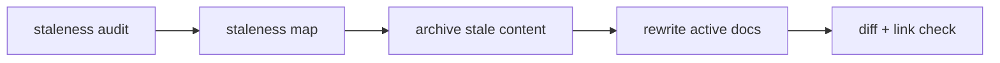

# Docs Refresh Flow

Use this reference when the user asks to update Obsidian project docs from a staleness audit, dev record, review note, or current implementation reality.

## Purpose

A docs refresh is not an append-only changelog and not a scheduled ritual. It is reactive maintenance: archive old claims, rewrite active docs to reflect the present, and prefer diagrams over prose where structure matters.

Trigger it only when one of these inputs exists:

- a staleness audit, dev record, or external review flags specific drift
- a major project shift landed and state/design docs no longer describe reality
- lint or health reports surface measurable drift that needs human-readable repair

If a project needs calendar-based refreshes, revisit generated `CURRENT.md` rollups instead of turning `$docs-refresh` into a recurring manual chore.

## Entry points

- Claude: `/docs-refresh <audit-doc-or-topic>`
- Codex and agents without custom slash commands: `$docs-refresh <audit-doc-or-topic>`
- Natural language triggers: "update obsidian docs", "refresh docs from audit", "按照 ... staleness-audit.md 更新文档", "文档过时", "归档旧内容".

## Preconditions

1. Confirm a strong team project signal and locate `obsidian-docs/` or the registered docs path.
2. Check docs git status before editing. If dirty, summarize existing changes and do not overwrite them blindly.
3. Read only the minimal source set:
   - the user-provided staleness audit/dev record, if any
   - `CURRENT.md`, `RISKS.md`, `NEXT.md`, `TODO.md`
   - specific design/reference docs named by the audit
4. Do not scan the whole vault. Load more docs only when the audit points to them.

## Step 1: build a staleness map

Create a working map before editing:

| File | stale claim | current truth | action | archive target |
|---|---|---|---|---|
| `OVERVIEW.md` | old architecture | new module split | rewrite + archive old section | `archive/YYYY-MM-DD-<topic>/OVERVIEW-old-architecture.md` |

Actions:

- `rewrite`: active doc remains canonical, with stale prose removed.
- `split`: move background/history into a separate reference or archive file.
- `archive`: move an obsolete file or section under `archive/`.
- `no-op`: audit item is already current.

## Step 2: archive-first editing

Before adding new active prose, remove stale material from active docs.

- Prefer `archive/YYYY-MM-DD-<topic>/...` when moving multiple related old sections/files.
- Preserve useful historical context in archive frontmatter: `status: archived`, `updated: YYYY-MM-DD`, and a short note linking the replacement active doc.
- Never turn active docs into a timeline of "old -> new -> newer" updates. Active docs describe current truth only.
- `trace` files (`_handoffs/`, `开发记录/`) remain historical and should not be rewritten except typo fixes.
- Decisions are superseded with a new ADR/decision entry; do not silently rewrite decision history.

## Step 3: rewrite active docs as current truth

For `CURRENT.md`, `NEXT.md`, `RISKS.md`, `TODO.md`, `OVERVIEW.md`, and design docs:

- Replace obsolete statements instead of appending corrections below them.
- Keep state docs one-screen and under their target line budget.
- Include links to archived material only when a reader needs the history.
- Update frontmatter `updated: YYYY-MM-DD` on every substantially edited Markdown file.
- Avoid vague prose like "recently changed"; use concrete module names, branch names, dates, and status.

## Step 4: diagram-first rule

Use fewer paragraphs and more diagrams for high-level design docs and TODO planning.

Good uses of Mermaid:



- Architecture/design: `flowchart`, `sequenceDiagram`, or `C4-style` Mermaid when dependencies or data flow matter.
- TODO: use Mermaid dependency graphs for task order; keep checklist text short.
- Risks: use small tables; add a Mermaid flow only when risk propagation is structural.
- Do not add decorative diagrams. A diagram must replace or clarify prose.

## Step 5: verify the refresh

Before reporting completion:

1. `git diff --stat` and inspect every changed file.
2. Confirm stale claims named by the audit were removed from active docs or intentionally marked `no-op`.
3. Confirm archived content exists when material was removed.
4. Confirm active docs still link to the right current entry points.
5. Confirm frontmatter dates were updated.
6. Confirm Mermaid blocks render syntactically enough for Markdown review: fenced as ```mermaid and not nested inside lists/tables.
7. Run `git diff --check`.

## Report format

End with:

- `Updated active docs`: files and current-truth changes.
- `Archived stale content`: archive paths and source docs.
- `Diagrams added/updated`: Mermaid blocks and why they replace prose.
- `No-op audit items`: stale-audit claims that were already current or intentionally skipped.
- `Verification`: commands and results.

## Git governance

Docs refresh often touches high-level shared docs. Use a GitLab docs MR unless the project explicitly allows direct push for the touched paths. Personal dev records may be direct-push only when project policy allows it. Never `git add .`; stage exact files.
